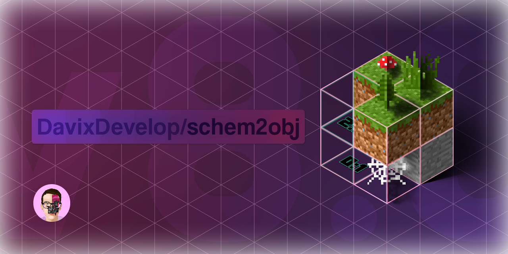

# 

A java program for converting Minecraft 1.12 schematics to OBJ (Wavefront)
with support for multiple resource packs (only in SEUS and Vanilla Format for now).  The MTL file uses
the PBR .mtl extension, so importing of MTL files with all PBR textures (when resource pack is used) is supported starting
with `Blender 3.4.1`.

### Supported blocks
All basic blocks (that are only basic cubes), and builtin blocks (ex, water, banners...) are supported. Other blocks and entities that don't work are currently being implemented.
 List of custom blocks implemented:
- Grass Block (non-snowy and snowy)
- Glass Pane & Block (regular and stained)
- Stairs
- Doors
- Fences
- Redstone Dust
- Slabs
- Iron Bars
- Water
- Lava
- Fire
- Leaves
- Cauldron
- Command Block
- Lit Furnace
- Lit Pumpkin
- Rough Prismarine Block
- Sea Lantern
- Magma Block (fixed compressed texture)
- Tall Grass
- Double Plant
- Fence Gate
- Wall

### Supported entities
- Beds
- Banners (Colored and patterned)
- Signs (ASCII and Unicode glyphs)
- Minecart
- Skull's & Player Heads
- Chests (Including Christmas chests)
- Paintings
- Boats (All variants)
- Item Frames (Including holding items (all supported blocks & entities))
- Armor Stand & Armor

### Supported resource packs
For now, only resource packs that use the SEUS or Vanilla format are supported. Beside using the textures the resource pack includes,
it also reads the models & block states the resource pack defines. It is recommended to unzip the resource pack beforehand, but zipped resource packs are supported as well.

To add a resource pack or multiple ones, first use the optional parameter `-t`, specify the format, ex. `SEUS:` and afterward specify the path to the resource pack.

If you wish to add any additional resource pack separate them with a space. Ex: `-t SEUS:C:\Users\user\AppData\Roaming\.minecraft\resourcepacks\PBRResourcePack SEUS:C:\Users\user\AppData\Roaming\.minecraft\resourcepacks\PBRResourcePack2.zip`

> **Note: If the path contains a space, wrap each parameter value in quotation marks.**  
> Ex: `-t "SEUS:C:\Users\user name\AppData\Roaming\.minecraft\resourcepacks\PBRResourcePack" "SEUS:C:\Users\user name\AppData\Roaming\.minecraft\resourcepacks\PBRResourcePack2.zip"`

### Usage
To use the program open the terminal and see the following syntax: 
> `java -jar (<path-to-jar>/)schem2obj-<release version>.jar -minecraftFolder <minecraft path> -i <input schematic> -o <output obj> (Optional parameters: -t <resource pack path> -biome <biome_id> -allBlock -snowy -christmasChests)`

The paths can either be absolute or relative.

Required parameters:
- `-minecraftFolder` The absolute path to the minecraft installation game directory.  
> **Make sure the installation has the 1.12.2 version installed. You can check this if the file `versions/1.12.2/1.12.2.jar` exist inside the game directory.** The reason why the program needs access to the `1.12.2.jar` file is because It's against the Minecraft EULA to provide the default textures and models in the source code itself.
- `-i` The absolute or relative path to the Schematic
- `-o` The absolute or relative path to the OBJ file

Optional parameters:
- `-allBlocks` If set, all blocks (including hidden) are exported
- `-snowy` If set, only the snowy grass is generated for now
- `-christmasChests` If set, all chests (except ender chests) use the Christmas texture
- `-biome <biome_id>` Specifies which biome to use (default: 1 -> Plains Biomes)
- `-t` The absolute or relative path to the resource pack (folder with `pack.mcdata` or zipped resource pack)

> 
> **Note:**  
> Marked with `(some parameter)` are optional parameters, and the actual input values with `<some value>`. Remove the `<>` and `()` parts before running the command in a terminal.
>  Ex. with both jar, schematic and output OBJ file in same folder, and the unpacked resource pack in your `.minecraft` (with the resource pack only in the SEUS or Vanilla format for now), you would run the following command: 
>
> `java -jar schem2obj-0.7.55.jar -minecraftFolder C:\Users\user\AppData\Roaming\.minecraft -i Celje.schematic -o Celje.obj -t SEUS:C:\Users\user\AppData\Roaming\.minecraft\resourcepacks\PBRResourcePack`

> **Note:** 
> If your paths **contain spaces**, enclose the path with quotes, ex. `"C:\Users\user surname\Documents\Celje.schematic"`.

### Blender 3.4.1+ Import Procedure

To import the generated OBJ into Blender 3.4.1 and later, create a new collection, select the collection and import the obj into the newly created collection using `File->Import->Wavefront (.obj)`.

Once It's imported, to properly set up the materials and other settings, use the companion `MCImportCleanUp_Blender.py` script. 
Go to scripting tab, open the script, optionally change the input parameters situated at the top and run the script with `Alt+P`.

### Need help or have a question?
You can contact me on Discord, under `davixdevelop`.

### About me

Hi, I'm David, a broke computer technician and amateur artist based in Celje, Slovenia.
Duo to various reason, like depression and mental health problems for the last 4 years of my life, I had to drop out of university, and I'm yet to find a job at 25.
If you found my projects or help usefully, I would appreciate any donation.

